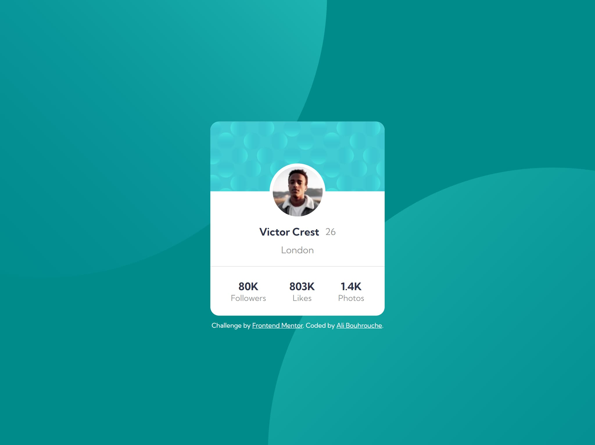

# Frontend Mentor - Profile card component solution

This is a solution to the [Profile card component challenge on Frontend Mentor](https://www.frontendmentor.io/challenges/profile-card-component-cfArpWshJ). Frontend Mentor challenges help you improve your coding skills by building realistic projects. 

## Table of contents

- [Overview](#overview)
  - [The challenge](#the-challenge)
  - [Screenshot](#screenshot)
  - [Links](#links)
- [My process](#my-process)
  - [Built with](#built-with)
  - [What I learned](#what-i-learned)
- [Author](#author)


## Overview

### The challenge

- Build out the project to the designs provided

### Screenshot



### Links

- Solution URL: https://github.com/alibouhrouche/profile-card-component-v1
- Live Site URL: https://alibouhrouche.github.io/profile-card-component-v1/

## My process

### Built with

- Flexbox
- [Sass](https://sass-lang.com/)

### What I learned

I learned how to create the background pattern using background-position.

```scss
  background-position: top -500px right 45vw, bottom -500px left 45vw;
```

## Author

- Website - [Ali Bouhrouche](https://ali.js.org)
- Frontend Mentor - [@alibouhrouche](https://www.frontendmentor.io/profile/alibouhrouche)
